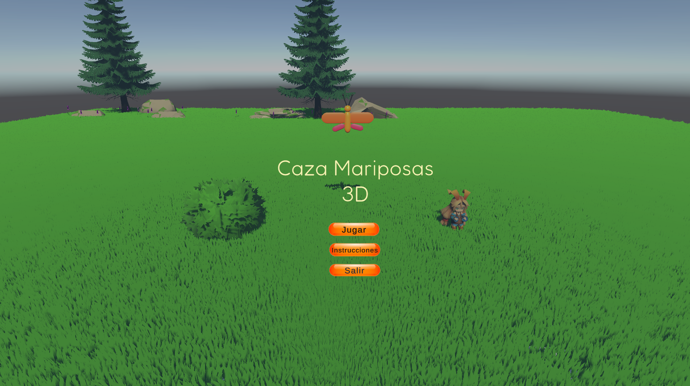
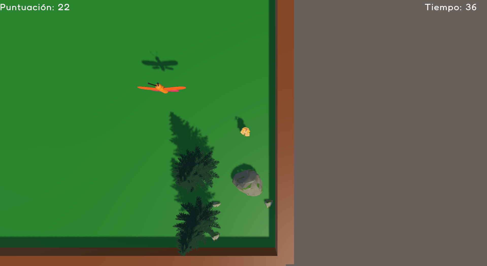
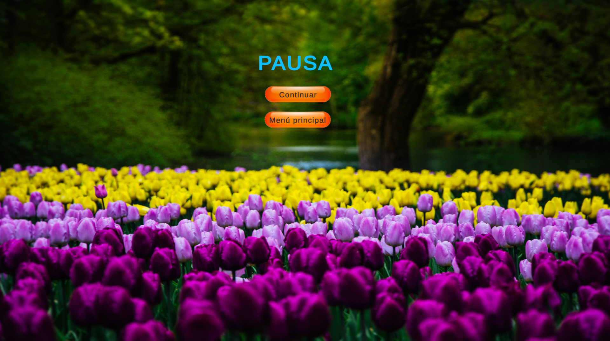
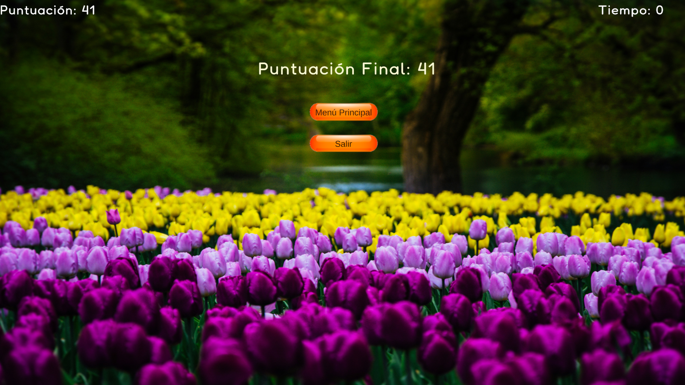

# 🦋 Caza Mariposas 3D

Juego 3D desarrollado en **Unity 6 y C#** como proyecto final del curso de Desarrollo de Videojuegos.

## 🎮 Descripción

El jugador debe cazar mariposas antes de que lleguen al suelo, desplazándose por un escenario 3D ambientado en un entorno natural.

La partida tiene una duración limitada y el objetivo es conseguir la mayor puntuación posible.

## 📸 Capturas
### 🏠 Menú principal

### 🦋 Gameplay

### ⏸️ Escenario y pausa

### 🏆 Resultado de la partida

## 🕹️ Controles

* **WASD** — Mover al personaje
* **Escape** — Pausar / reanudar la partida

## ⚙️ Mecánicas

* 🦋 **Capturar una mariposa:** +5 puntos
* 🌱 **Mariposa toca el suelo:** -1 punto
* 🌳 **Mariposa toca un obstáculo:** -1 punto
* ⏱️ **Duración de la partida:** 90 segundos
* ⏸️ **Sistema de pausa**
* 🏆 **Pantalla de puntuación final**
* 🚪 **Opción para salir desde el menú principal**

## 🔧 Mejoras y correcciones

Durante el desarrollo se revisaron y mejoraron diferentes aspectos del comportamiento del juego:

* **Movimiento del jugador:** se normalizó el movimiento para evitar que el personaje se desplazara más rápido al moverse en diagonal.
* **Paredes y obstáculos:** se mejoró el comportamiento de las colisiones utilizando detección de obstáculos y deslizamiento sobre las superficies, evitando movimientos bruscos y temblores.
* **Zona de aparición:** se limitó el sistema de aparición de mariposas a la zona jugable.
* **Seguridad de las mariposas:** se añadió un tiempo máximo de vida para evitar que las mariposas permanezcan indefinidamente en escena.
* **Colisiones:** se implementó la gestión de las colisiones entre las mariposas, el jugador, el suelo y los obstáculos.
* **Puntuación:** se establecieron diferentes valores según la interacción con las mariposas.
* **Flujo de partida:** se implementaron temporizador, pausa, final de partida y pantalla de puntuación final.
* **Navegación:** se añadieron las diferentes escenas del juego y las opciones de navegación desde el menú principal.

## 🛠️ Tecnologías

* **Unity 6**
* **C#**
* **Unity Physics**
* **TextMeshPro**
* **Animator**
* **Git / GitHub**
* **Unity Asset Store**

## 💻 Sistemas implementados

El proyecto cuenta con diferentes scripts para gestionar sus sistemas principales:

* `JugadorController` — Movimiento, rotación y control del jugador.
* `SpawnerMariposas` — Aparición de mariposas dentro de la zona jugable.
* `MariposaColision` — Gestión de las colisiones, destrucción de mariposas y puntuación.
* `GameManager` — Gestión de puntuación, tiempo, pausa y final de partida.
* `CameraFollow` — Seguimiento de la cámara respecto al jugador.
* `MenuManager` — Navegación entre escenas y salida del juego.

## 📂 Escenas

El proyecto está dividido en tres escenas principales:

* **Menu** — Menú principal.
* **Instrucciones** — Explicación de los controles.
* **Game** — Partida principal.

## ▶️ Cómo jugar

1. Ejecutar la versión para Windows.
2. Seleccionar **Jugar** en el menú principal.
3. Utilizar **WASD** para desplazarse.
4. Capturar las mariposas antes de que lleguen al suelo.
5. Evitar que las mariposas choquen con los obstáculos.
6. Conseguir la mayor puntuación posible antes de que termine el tiempo.

## 📦 Build

El proyecto cuenta con una versión preparada para **Windows**.

El código fuente y los recursos principales del proyecto se encuentran disponibles en este repositorio.

## 👩‍💻 Proyecto

Proyecto desarrollado como parte de mi formación en **Desarrollo de Videojuegos**, con especial atención a la programación de gameplay, físicas, gestión de escenas e interfaz de usuario.

**Irene**

